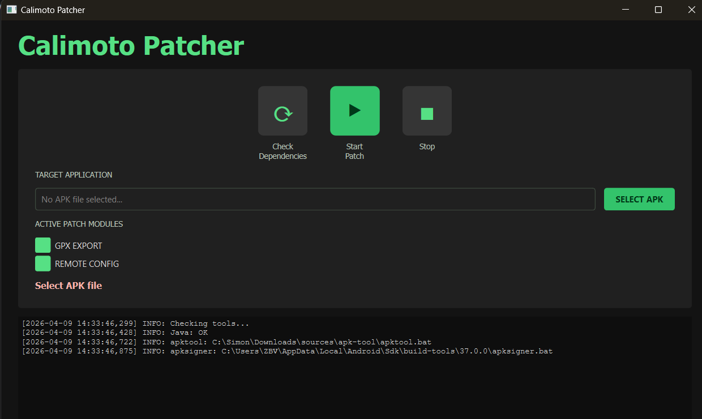

# Calimoto APK Patcher Tool



## Installation

get the calimoto apk from apkpure: <https://apkpure.com/de/calimoto-%E2%80%94-motorcycle-gps/com.calimoto.calimoto>

### Install dependencies

**Windows:**
1. Java: <https://www.oracle.com/java/technologies/downloads/>

2. Android SDK Build Tools (apksigner)
- Option A: Android Studio
         <https://developer.android.com/studio>

- Option B: only build tools
         <https://developer.android.com/tools/releases/build-tools>

3. apktool: <https://ibotpeaches.github.io/Apktool/>

**Linux:**
```properties
apt-get install -y default-jdk apktool android-sdk-build-tools
```

**macOS:**
```properties
brew install openjdk apktool android-sdk
```

# start python script

```properties
# install dependencies
pip install PySide6 

python calimoto_patcher.py
```

### TODOs
- show errors in app
- make everything english
- delete old `apk` and `idsig`